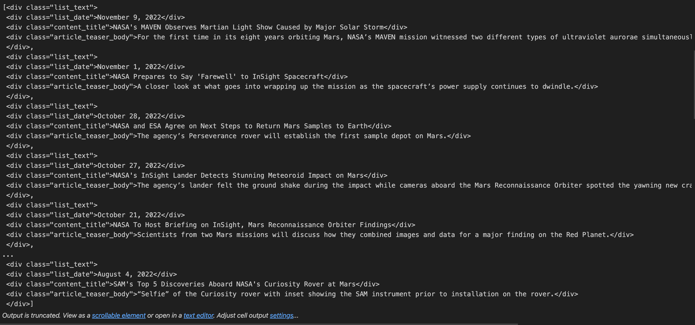

# web_scrape_challenge

A web scraping challenge that uses Splinter, bs4, Python, Pandas, Numpy and Matplotlib to scrape and analyze planetary data from a website. 

## Table of Contents
#### Introduction
#### Requirements & Dependencies
#### Project Structure
#### Analysis and Results
#### Usage
#### Contributing
#### License
 

#### Introduction
This project uses two Jupyter Notebook script with Splinter, bs4, Python, Pandas, Numpy and Matplotlib to scrape and analyze Mars data from a website. 

##### Features
- Automated browsing with Splinter Browser.

- Webscraping with bs4:Beautiful Soup

- Create Pandas DataFrame with scraped data

- Create JSON list with scraped data

 

#### Requirements & Dependencies
You will need the following software and Python libraries to run the Jupyter Notebook scripts:
- Python 3.10
- Pandas
- NumPy
- Matplotlib
- Splinter
- bs4
- Requests
- JSON
 

### Part 1: Mars News
- The task begins by automating browsing with Splinter Browser to navigate to the desired URL.  
 
 

---
- A Beautiful Soup object is created to extract the all elements belonging to the "list_text" class. 

 
 

 
 
 
 
 

---
- The Scraped data is stored as dictionaries in a Python list.

 
 

 
 
 
 
 

---
- The dictionaries are exported to a JSON file.

 
 

 
 
 
 
 

---

### Part 2: Mars Weather
- The task begins by automating browsing with Splinter Browser to navigate to the desired URL.  
 
 

---
- A Beautiful Soup object is created to find the Mars weather data table and extract all the rows of data. 
 
 

---
- Two empty lists are created: one for rows and the other for column names.  Two separate 'for' loops are used to append the lists with their respective data. Elements of the 'td' class are appended to the rows list, and those of the 'th' class are appended to the column names list.
 
 

---
- The column names are checked.
 
 

 
 
 
 
 

---
- The table rows are checked.

 
 
 
 
 

---
- Pandas is used to create a DataFrame from the table rows, and the head of the DataFrame is checked. 
 
 
 
 
 
 

---
- The data types of the columns are checked and then changed where necessary for further analysis.
#### Data types before 

 
 

#### Data types after 

 
 
 
 
 

---
- The number of unique months in the DataFrame is checked, and then a statement is printed to state the number of months on Mars. 

 

 
 
 
 

---
- The number of Martian days in the data set is checked and printed. 

 
 
 
 
 

---
- The average minimum temperature of each martian month is checked, and the plotted as a bar graph. The bar graph is then revised with bars in ascending order. 

 

 

 
 
 
 
 

---
- The average minimum temperature bar graph is analyzed and checked with code, and then a statement is printed to tell the coldest and hottest months on Mars. 

 
 
 
 
 

---
- The average atmospheric pressure of each month is checked, and then plotted as a bar graph.

 

 
 
 
 
 

---

- The average atmospheric pressure bar graph is analyzed and checked with code, and then two statements are printed to tell the months with the lowest and highest atmospheric pressure.

 
 
 
 
 

---
- The lowest min-temp for each martian day (sol) is checked and graphed. 

 
 
 
 
 

--- 
- The number of Earth days in a martian year is estimated by subtracting the inputs of two consecutive peak coordinates of the graph. ie. 1425-650 = 675. A reliable source is also check on the internet to validate the estimation. 
 

#### Martians years (NASA.gov website)

 
 
 
 
 

---
- The DataFrame that was created at the beginning of the task is saved as a csv file.

 
 
 
 
 

---
#### Usage
1. Ensure that you have installed all the required dependnecies, preferably in a virtual environment.
2. Distribute the codes in  each script, step by step, in an appropriate code editor such as Jupyter Notebook. All output will be displayed inline. 

#### Contributions
Contributions to this project are highly encouraged! If you wish to contribute, please follow these guidelines:

- Fork the web_scrape_challenge repository and clone it locally.
- Create a new branch for your feature or bug fix.
- Commit your changes with descriptive commit messages.
- Push your branch to your forked repository.
- Submit a pull request to the original repository.
- Please ensure that your code adheres to the project's coding style and conventions.

If you encounter any issues or have suggestions for improvements, please open an issue on the GitHub repository.

### License
These projects are licensed under the MIT License. Feel free to use, modify, and distribute the code as per the terms of the license. 